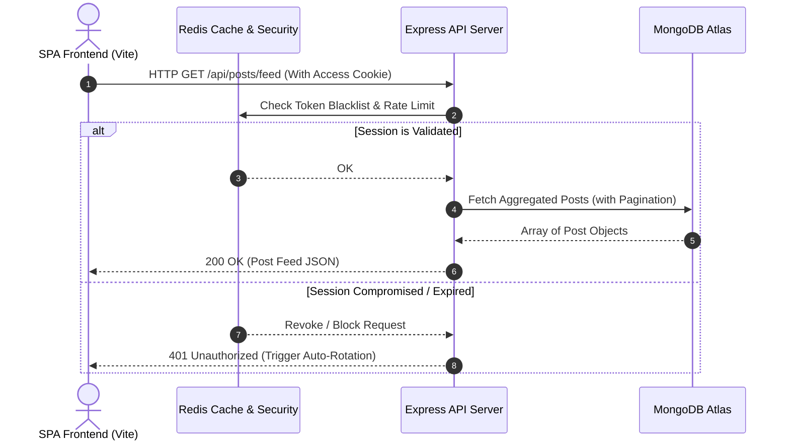

<!-- BRAND HEADER -->
<p align="center">
  
</p>

<h1 align="center">🔮 SocialNest</h1>
<p align="center">
  <strong>Share · Chat · Belong</strong>
</p>

<p align="center">
  A premium, full-stack, enterprise-grade social media ecosystem built for ultra-responsive user experience and advanced micro-interactions. SocialNest combines a glassmorphic visual system with highly secure authentication structures, real-time communication channels, and decentralized media delivery.
</p>

<p align="center">
  
  
  
  
  
  
</p>

---

## 🎯 Architectural Overview & Engineering Depth

SocialNest is architected from the ground up to showcase advanced full-stack engineering principles, separating concerns across modular, scalable layers.



### 🛡️ 1. Enterprise Security Architecture
* **HttpOnly Cookie Auth:** JWT access and refresh tokens are securely compartmentalized inside strict `httpOnly`, `secure`, and `sameSite` browser cookies, rendering them entirely immune to XSS token theft.
* **Refresh Token Rotation (RTR):** Protects against session-hijacking. Every single token-refresh request invalidates the old token family. If a reused token is detected, Redis instantly blacklists the entire token family, forcing a global logout across all sessions.
* **Account Lockout Protection:** Mitigates brute-force attacks by tracking failed logins in Redis. On the 5th failed attempt, the account is temporarily locked with an exponential cool-down threshold.
* **CSRF Tokenization:** Safe request verification via decoupled double-submit cookie validations for mutative requests.

### ⚡ 2. Real-Time Infrastructure (Socket.IO & Redis)
* **Secure Handshake Interception:** The Socket.IO server authenticates connections during the handshake phase by parsing and decrypting secure HTTP cookie parameters directly, preventing unauthenticated connection spam.
* **Personal Room Routing:** On socket connection, users are automatically allocated to a private channel room (`userId`) for real-time delivery of push notifications, DMs, and interactive states.

### 🎨 3. Premium Frontend Visual Engine
* **Optimistic UI Engine:** Engagement actions (likes, bookmarks, comments) update the user interface instantly before receiving backend confirmations, falling back gracefully upon server error to minimize perceived latency.
* **Framed Micro-Animations:** Fluid, staggered listing entries, responsive slide-out panels, and spring-based modal popups powered by `framer-motion`.
* **Shimmering Skeleton Loaders:** Custom-built layout-mimicking SVG shimmer skeletons ensure a premium, zero-jank content-loading experience.

---

## ✨ Feature Breakdown

### 🔐 Authentication & Core Security
- **Strict Verification Flow:** Dual-phase sign-up using cryptographically signed verification links via Nodemailer.
- **Lockout Shield:** Tracks login failures via Redis and triggers temporary blocks after 5 consecutive failures.
- **Login Device Ledger:** Audits login activity, parsing User-Agent structures to track active sessions across devices.
- **Secure Password Reset:** Secure 15-minute token-based recovery flows.

### 📸 Ephemeral Stories & Posts
- **Active Post Feed:** Personal, public, and followed feeds sorted by engagement metrics.
- **ephemeral Stories:** 24-hour ephemeral image and video slides powered by MongoDB TTL index databases.
- **Media CDN Optimization:** Decentralized image uploads using ImageKit CDNs for quick load speeds and compression.
- **Interactives:** Cascade post deletion, comments, and nesting capabilities.

### 💬 Instant Real-Time Chat & Groups
- **DM Systems:** Direct messaging with full historic logs.
- **Social Groups:** Join public or private group modules with specialized feeds and role-based administrative control.
- **Real-time Notifications:** Real-time push updates for likes, comments, and follow request changes.

### 🛡️ Admin Controls & Reporting
- **In-App Moderation:** Flag and report posts or users.
- **Admin Dashboard:** Access analytics, manage user bans, and resolve open reports.

---

## 🛠️ Technology Stack

| Layer | Selected Technologies | Rationale / Benefits |
| :--- | :--- | :--- |
| **Frontend** | React 19, Vite 8 | Ultra-fast SPA bundles, efficient DOM diffing, and HMR development. |
| **Styling** | Vanilla SCSS, Variable Architecture | Fully scalable glassmorphism definitions, modular spacing, and design variables. |
| **Animations** | Framer Motion | Smooth, physics-based UI transitions and staggered entries. |
| **Backend** | Node.js, Express 5 | High-throughput asynchronous event loop with Express 5 routing. |
| **Database** | MongoDB Atlas, Mongoose 9 | Document store with deep schema modeling and TTL capabilities. |
| **Caching/Security** | Redis Cloud, ioredis | Ultra-low latency rate-limiting, session blocklists, and brute-force protection. |
| **Media Host** | ImageKit CDN | Automated image optimization, compression, and edge distribution. |

---

## 📂 Scalable Project Structure

```
SocialNest/
├── Backend/
│   ├── server.js                    # Entry point (HTTP + Socket.IO handshake)
│   ├── src/
│   │   ├── app.js                   # Middleware routing, rate-limiters, & Helmet
│   │   ├── config/                  # Database connections & Redis configuration
│   │   ├── controllers/             # Core business logic handlers
│   │   ├── models/                  # Mongoose data modeling & hooks
│   │   ├── routes/                  # Express decoupled endpoint maps
│   │   ├── middlewares/             # JWT authenticators & CORS verifications
│   │   ├── services/                # Token rotation, lockout, & session tracking
│   │   ├── validators/              # Joi strict input validator schemas
│   │   └── utils/                   # Custom error/response classes & SMTP utils
│
├── Frontend/
│   ├── index.html                   # Main entry & SEO Meta Tags
│   └── src/
│       ├── main.jsx                 # Entry execution & providers
│       ├── App.jsx                  # Root layout & Framer Motion routing
│       ├── components/              # Global UI elements & Skeletons
│       └── features/                # Domain-Driven modular components
│           ├── auth/                # Sign-in, Onboarding, and Hooks
│           ├── post/                # Feed, Create, Search, and Likes
│           ├── user/                # Profile Grid, Follow lists, and header
│           ├── story/               # Story bar progress slides and view logs
│           └── settings/            # Dark configuration models & account deletion
```

---

## 🔑 Environment Configuration

### Backend Variable Registry (`Backend/.env`)

| Variable | Type | Description | Required |
| :--- | :---: | :--- | :---: |
| `MONGO_URI` | `string` | MongoDB Atlas cluster connection URI. | ✅ |
| `ACCESS_TOKEN_SECRET` | `string` | Cryptographically secure 256-bit JWT Access key. | ✅ |
| `REFRESH_TOKEN_SECRET` | `string` | Cryptographically secure 256-bit JWT Refresh key. | ✅ |
| `REDIS_HOST` | `string` | Target endpoint for Redis Cloud cache. | ✅ |
| `REDIS_PORT` | `number` | Connection port for Redis server. | ✅ |
| `REDIS_PASSWORD` | `string` | Access credentials for Redis server. | ✅ |
| `IMAGEKIT_PUBLIC_KEY` | `string` | Access token for the ImageKit CDN dashboard. | ✅ |
| `IMAGEKIT_PRIVATE_KEY` | `string` | Private decryption token for CDN uploads. | ✅ |
| `IMAGEKIT_URL_ENDPOINT` | `string` | Base path URL of your ImageKit storage. | ✅ |
| `SMTP_USER` | `string` | SMTP Zoho email service address. | ✅ |
| `SMTP_PASS` | `string` | Credentials for Nodemailer outbound email. | ✅ |

### Frontend Variable Registry (`Frontend/.env`)

| Variable | Type | Description | Required |
| :--- | :---: | :--- | :---: |
| `VITE_API_URL` | `string` | Target endpoint URL hosting the backend API. | ✅ |

---

## 📡 Core API Reference

### 🔐 Authentication Operations

| Method | Endpoint | Auth | Description |
| :---: | :--- | :---: | :--- |
| `POST` | `/api/auth/register` | ❌ | Submits credentials and sends Nodemailer verification. |
| `POST` | `/api/auth/login` | ❌ | Signs user in, generates secure cookies, and checks lockout. |
| `GET` | `/api/auth/verify-email/:token` | ❌ | Verifies email via token and creates database user. |
| `POST` | `/api/auth/refresh-token` | ❌ | Validates refresh cookie, executes RTR rotation. |
| `POST` | `/api/auth/logout` | ✅ | invalidates active token and blacklists cookie. |

### 📸 Post & Feed Operations

| Method | Endpoint | Auth | Description |
| :---: | :--- | :---: | :--- |
| `POST` | `/api/posts` | ✅ | Uploads media content and registers tag details. |
| `GET` | `/api/posts/feed` | ✅ | Serves personalized feed with optimized query sorting. |
| `POST` | `/api/posts/like/:postId` | ✅ | Optimistically toggles like count. |
| `POST` | `/api/posts/save/:postId` | ✅ | Bookmarks post to personal library. |
| `DELETE` | `/api/posts/:postId` | ✅ | Removes post and cleans references. |

---

## 🚀 Getting Started

### Prerequisites
* **Node.js** Version ≥ 18.x
* **MongoDB** Dedicated Atlas Cluster
* **Redis** Production Instance
* **ImageKit** Account

### 1. Installation & Environment Setup
```bash
# Clone repository
git clone https://github.com/imshubhryan/SocialNest.git
cd SocialNest

# Setup Backend
cd Backend
npm install
cp .env.example .env # Update credentials in .env

# Setup Frontend
cd ../Frontend
npm install
cp .env.example .env # Set VITE_API_URL to http://localhost:3000
```

### 2. Launch Development Servers
Run the API services in tandem:

**Backend Server (Terminal 1):**
```bash
cd Backend
npm run dev
```

**Frontend Bundler (Terminal 2):**
```bash
cd Frontend
npm run dev
```

---

## 📦 Deployment Guide

### Backend (Render / VPS)
1. Provision a **Web Service** container on Render.
2. Bind all values listed in `Backend/.env.example` as environment variables.
3. Configure `NODE_ENV=production`.
4. Point your deploy build steps to: `npm install` and start script to `node server.js`.

### Frontend (Vercel)
1. Link your GitHub repository to Vercel.
2. Bind `VITE_API_URL` to point to your deployed Render URL.
3. Set the build execution to `npm run build` and target the `dist` directory.

---

## 🖼️ Interface Demonstrations
*(Screenshots representing premium visual updates)*

| Post Feed | User Profiles | Story Slides | Realtime DM |
| :---: | :---: | :---: | :---: |
|  |  |  |  |

---

## 🔮 Future Roadmap
- [ ] **Native Web Push:** Native desktop notifications via Web Push APIs.
- [ ] **Algorithmic Explore Page:** Custom discovery feed using engagement metrics.
- [ ] **Media Pipeline Transcoding:** Auto-compress and format media files during upload.
- [ ] **OAuth Integrations:** One-click Google and GitHub authentication.

---

## 📄 License & Intellectual Property
This project is private and proprietary. All rights reserved.

<p align="center">
  Made with ❤️ by the SocialNest Team
</p>
